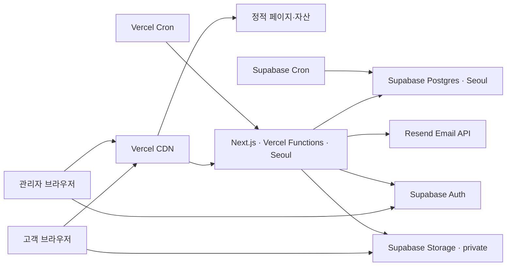
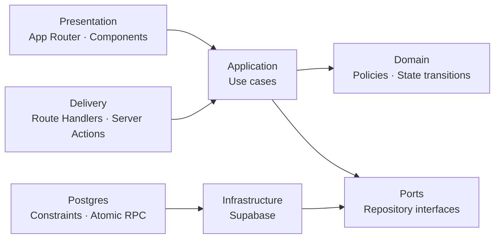

# booth booth 선착순 커스텀 상품 주문 서비스 기술 설계서

- 문서 버전: v0.4
- 작성일: 2026-08-20
- 연계 문서: [PRD](./PRD.md)
- 상태: MVP 구현 반영 완료

## 1. 기술 목표

1. 다수의 동시 요청에도 관리자가 설정한 주문 건수 제한을 절대 초과하지 않는다.
2. 예약, 주문 제출, 취소, 복구를 재시도해도 중복 결과가 생기지 않는다.
3. 고객 개인정보를 브라우저나 공개 Supabase API에 불필요하게 노출하지 않는다.
4. 한 명의 관리자가 상품, 판매, 입금, 주문, 배송을 운영할 수 있다.
5. 데이터베이스 스키마와 정책을 마이그레이션으로 재현할 수 있다.
6. Vercel과 Supabase의 관리형 기능을 우선 사용해 운영 부담을 줄인다.

## 2. 확정 기술 스택

| 영역 | 선택 | 사용 목적 |
|---|---|---|
| 언어 | TypeScript strict mode | 프런트엔드와 서버 경계의 타입 안정성 |
| 웹 프레임워크 | Next.js App Router fullstack | Server Component, Server Action, Route Handler |
| 배포·서버 런타임 | Vercel | CDN, SSR, Vercel Functions, 도메인 |
| 데이터베이스 | Supabase Postgres | 주문·예약·설정 데이터, 트랜잭션, 제약조건 |
| 백엔드 API | Next.js Route Handlers on Vercel Functions | 예약·주문·관리 API |
| 관리자 인증 | Supabase Auth | 관리자 이메일·비밀번호 로그인 |
| DB 접근 | `@supabase/supabase-js`, `@supabase/ssr` | 서버 DB 접근과 관리자 SSR 세션 |
| 스키마 관리 | Supabase CLI migrations | DB 함수, 테이블, 인덱스, RLS 버전 관리 |
| 주소 검색 | Kakao 우편번호 서비스 | 국내 우편번호 및 주소 검색 |
| 파일 저장 | Supabase Storage private bucket | 상품별 디자인 참고 이미지 |
| 이미지 처리 | 브라우저 기반 리사이즈·형식 변환 | iPhone HEIC/HEIF 포함 모바일 업로드 최적화 |
| 주문 이메일 | Resend Email API | 주문번호 안내, idempotency key 기반 중복 방지 |
| 유효성 검사 | Zod | 요청·폼·환경변수 런타임 검증 |
| 폼 | React Hook Form + Zod resolver | 주문서 및 관리자 폼 상태 관리 |
| 테스트 | Vitest, Testing Library, Playwright | 단위·컴포넌트·E2E 테스트 |

### 버전 정책

- 구현 시작 시점의 최신 보안 패치가 적용된 Next.js 16.x 안정 버전을 정확히 고정한다.
- 현재 기술 기획 기준 최신 릴리스 계열은 Next.js 16.3이다.
- `latest` 범위는 사용하지 않고 `package-lock.json`을 커밋한다.
- TypeScript, React, Supabase SDK도 구현 시작 시 호환되는 정확한 버전을 고정한다.
- Dependabot 또는 Renovate 도입은 개발 시작 시 결정한다.

## 3. 배포 구조



### 리전

- Supabase 프로젝트: `Northeast Asia (Seoul) / ap-northeast-2`
- Vercel Functions: `icn1`을 기본 리전으로 설정
- 정적 자산은 Vercel CDN에서 전 세계에 제공한다.
- Vercel Functions와 DB를 같은 지역에 두어 트랜잭션 지연을 최소화한다.
- 리전은 실제 프로젝트 생성 시 두 플랫폼의 가용성을 다시 확인한다.

### 실행 환경

- 빌드 시 렌더링 가능한 Server Component는 정적 결과물로 생성되어 CDN에서 제공된다.
- 요청 시 데이터·쿠키·인증이 필요한 Server Component, Server Action, Route Handler는 Vercel Functions에서 실행된다.
- Supabase Edge Functions는 사용하지 않는다.
- 선착순 판단에 함수 프로세스의 전역 변수, 메모리 캐시 또는 단일 인스턴스를 사용하지 않는다.
- 여러 Vercel Function 인스턴스가 동시에 실행돼도 DB 트랜잭션이 정합성을 보장한다.

### 무료 요금제 전제와 출시 제약

- 개발·QA는 Vercel Hobby와 Supabase Free를 기준으로 한다.
- Vercel Hobby는 공식 정책상 비상업적 개인 사용만 허용한다. 상품 판매와 입금 요청은 상업적 사용에 해당하므로 실제 판매 배포 전 Vercel Pro 전환 또는 상업적 무료 사용을 허용하는 다른 정적 호스팅 검토가 필요하다.
- Supabase Free는 7일간 활동이 적으면 프로젝트가 일시 정지될 수 있다. 판매 최소 1주 전부터 활성 상태를 점검한다.
- Supabase Free에는 관리형 일일 백업이 없다. 판매 전후 `supabase db dump`로 별도 백업한다.
- Vercel Hobby는 월 1,000,000 Function 호출을 포함하지만 500명 동시 burst에 대한 성능 보장은 없다. 로컬 동시성 테스트와 실제 환경 사전 리허설이 필요하다.
- Supabase Realtime 무료 동시 연결 한도는 200이므로 500명 대상 실시간 연결은 사용하지 않고 공개 RPC 폴링을 사용한다.
- 무료 한도 초과 시 유료 초과분이 자동 청구되는 대신 서비스가 제한될 수 있다.

## 4. Next.js 애플리케이션 구조

```text
src/
├── app/
│   ├── page.tsx                         # 메인/상품 페이지
│   ├── order/                           # 주문서·완료·조회 인증
│   ├── orders/[orderNumber]/page.tsx    # 고객 주문 상세/수정
│   ├── admin/                           # 로그인 및 보호된 운영 화면
│   └── api/                             # 공개·주문·관리 API
├── features/
│   ├── sale/                            # 판매 도메인과 UI
│   ├── order/                           # 주문 스키마·도메인·UI
│   └── admin/actions.ts                 # 인증된 관리자 Server Actions
├── shared/
│   ├── config/                          # 환경변수 검증
│   └── ui/                              # 디자인 시스템 기본 컴포넌트
├── server/
│   ├── auth/                            # 관리자 인증
│   ├── email/                           # 주문 이메일 템플릿·outbox 처리
│   ├── orders/                          # 주문 조회 조립
│   ├── security/                        # 암호화·HMAC·접근 토큰
│   └── supabase/                        # SSR·브라우저·service-role 클라이언트
└── proxy.ts                             # Supabase 관리자 세션 갱신

supabase/
├── config.toml
├── migrations/
└── seed.sql
```

### 렌더링 원칙

- 메인 페이지의 상품 콘텐츠는 Server Component로 렌더링하고 캐시 정책을 명시한다.
- 주문서의 타이머, 옵션 편집, 비활성 감지는 Client Component로 격리한다.
- 관리자 페이지와 주문 상세는 인증 쿠키를 읽는 동적 Server Component로 렌더링한다.
- 고객·관리자 데이터는 브라우저에서 Supabase 업무 테이블을 직접 읽지 않는다.
- 상품 이미지는 Next.js Image와 Vercel CDN을 사용한다.

## 5. API 설계 원칙

- 모든 변경 요청은 Next.js Route Handler 또는 검증된 Server Action을 통과한다.
- 브라우저가 주문·예약 테이블에 직접 쓰지 않는다.
- Vercel Function은 Zod로 입력을 검증한 후 하나의 DB RPC를 호출한다.
- 접수 가능 여부를 API에서 읽고 애플리케이션 코드에서 계산한 다음 insert하는 패턴을 금지한다.
- DB 변경은 원자적 Postgres 함수가 검증과 쓰기를 한 트랜잭션 안에서 수행한다.
- 오류 응답은 안정적인 코드와 사용자 메시지를 분리한다.

### 표준 오류 형식

```ts
type ApiError = {
  error: {
    code:
      | 'SALE_NOT_STARTED'
      | 'SALE_ENDED'
      | 'SALE_PAUSED'
      | 'SOLD_OUT'
      | 'RESERVATION_EXPIRED'
      | 'DUPLICATE_ORDER'
      | 'INVALID_INPUT'
      | 'RATE_LIMITED'
      | 'UNAUTHORIZED'
      | 'CONFLICT'
    message: string
    requestId: string
  }
}
```

## 6. 공개 API 초안

| Method | Path | 역할 | 인증 |
|---|---|---|---|
| GET | `/api/public/sale-status` | 상태·카운트다운·잔여 건수 | 없음 |
| POST | `/api/reservations` | 주문 슬롯 확보 | 없음, rate limit |
| POST | `/api/reservations/heartbeat` | 활성 예약 lease 갱신 | 예약 쿠키 |
| POST | `/api/reservations/release` | 예약 명시적 반환 | 예약 쿠키 |
| POST | `/api/orders` | 예약을 주문으로 전환 | 예약 쿠키 + idempotency key |
| POST | `/api/order-images` | 압축된 이미지 한 장 업로드 및 임시 메타데이터 생성 | 예약 쿠키 |
| POST | `/api/orders/lookup` | 주문번호·전화 뒷자리 검증 | 없음, rate limit |
| GET | `/api/orders/[orderNumber]` | 인증된 주문 조회 | 주문 접근 쿠키 |
| PATCH | `/api/orders/[orderNumber]` | 허용된 고객 주문 수정 | 주문 접근 쿠키 |

### HttpOnly 쿠키

#### 예약 쿠키

- 이름 예시: `bb_reservation`
- `HttpOnly`, `Secure`, `SameSite=Lax`, `Path=/`
- 예약 토큰 원문은 DB에 저장하지 않고 해시만 저장한다.
- 최대 수명은 30분이다.

#### 주문 조회 접근 쿠키

- 주문번호와 전화 뒷자리 검증 후 해당 주문에만 유효한 서명 토큰을 발급한다.
- 이름 예시: `bb_order_access`
- `HttpOnly`, `Secure`, `SameSite=Lax`
- 수명 초안은 30분이다.
- 토큰 만료 후에는 주문번호와 전화 뒷자리를 다시 입력한다.
- 휴대전화 뒷자리를 URL이나 쿠키 평문에 넣지 않는다.

## 7. 데이터베이스 모델

### enum

```text
sale_state       = scheduled | open | manually_closed | ended
reservation_state = active | converted | released | expired
order_state      = payment_pending | payment_confirmed | preparing | completed | cancelled
payment_state    = pending | review_required | paid | refund_required | refunded
```

### sales

| 컬럼 | 타입 | 설명 |
|---|---|---|
| id | uuid PK | 판매 ID |
| title | text | 상품/판매명 |
| starts_at | timestamptz | 판매 시작 |
| ends_at | timestamptz | 판매 종료 |
| order_limit | integer | 기본 100 |
| manually_closed | boolean | 조기 마감 여부 |
| bank_name | text | 은행명 |
| bank_account_ciphertext | text | 암호화 계좌번호 |
| bank_holder | text | 예금주 |
| kakao_channel_url | text | 문의 링크 |
| shipping_notice | text | 배송 안내 |
| shipping_fee | integer | 무료배송 기준 미만 기본 배송비 |
| free_shipping_threshold | integer | 기본 배송비 무료 기준 |
| remote_area_surcharge | integer | 제주·도서산간 추가 배송비 |
| created_at / updated_at | timestamptz | 변경 시각 |

- DB에는 UTC 기반 `timestamptz`로 저장하고 UI에서 Asia/Seoul로 표시한다.
- 계좌정보는 주문 시점 스냅샷을 주문에 저장한다.

### products

| 컬럼 | 타입 | 설명 |
|---|---|---|
| id | uuid PK | 상품 ID |
| sale_id | uuid FK | 판매 |
| name | text | 상품명 |
| description | text | 고객 노출 상품 설명 |
| unit_price | integer | 원 단위 가격 |
| item_type | text | shirt 또는 bag |
| stock_limit | integer nullable | null이면 무제한 |
| sort_order | integer | 노출 순서 |
| option_groups | jsonb | 옵션 그룹과 선택값 설정 |
| customization_config | jsonb | 주문 입력 항목 활성화 설정 |
| active | boolean | 판매 노출 여부 |

### product_options

- 기존 데이터 마이그레이션 호환용 테이블이다. 운영 설정은 `products.option_groups`가 기준이다.
- 그룹과 선택값은 UUID 식별자를 가지며 이름, 선택 규칙, 추가금, 순서, 활성 상태를 JSON으로 저장한다.

### reservations

| 컬럼 | 타입 | 설명 |
|---|---|---|
| id | uuid PK | 내부 예약 ID |
| sale_id | uuid FK | 판매 |
| token_hash | text UNIQUE | 쿠키 토큰 해시 |
| state | reservation_state | 예약 상태 |
| hard_expires_at | timestamptz | 입장 후 30분 |
| lease_expires_at | timestamptz | heartbeat 단절 감지 |
| last_activity_at | timestamptz | 클라이언트 활동 보고 |
| converted_order_id | uuid nullable | 생성 주문 |
| created_at / updated_at | timestamptz | 시각 |

인덱스:

- `(sale_id, state, hard_expires_at)`
- `(sale_id, state, lease_expires_at)`
- `token_hash unique`

### orders

| 컬럼 | 타입 | 설명 |
|---|---|---|
| id | uuid PK | 내부 ID |
| sale_id | uuid FK | 판매 |
| order_number | text UNIQUE | 고객 공개 무작위 번호 |
| reservation_id | uuid UNIQUE FK | 중복 전환 방지 |
| customer_name | text | 주문자 이름 |
| phone_encrypted | text | 원본 전화번호 |
| phone_normalized_hash | text | 중복 검사 |
| phone_last4_hash | text | 주문 조회 검증 |
| depositor_name | text | 입금자명 |
| address_json | jsonb | 우편번호·주소 |
| total_quantity | integer | 주문 상품 수, 상한 없음 |
| subtotal_amount | integer | 옵션 추가금을 포함한 상품 합계 |
| base_shipping_fee | integer | 주문 시점 기본 배송비 |
| remote_area_surcharge | integer | 주문 시점 제주·도서산간 추가 배송비 |
| shipping_fee | integer | 기본 배송비와 지역 추가 배송비 합계 |
| delivery_zone | text | standard 또는 remote |
| total_amount | integer | 최종 입금액 |
| fulfillment_type | text | shipping 또는 pickup |
| pickup_slot_id | uuid nullable | 픽업 선택 시 시간대 |
| order_state | order_state | 주문 상태 |
| payment_state | payment_state | 입금 상태 |
| payment_review_reason | text nullable | 확인 사유 |
| payment_due_at | timestamptz | 생성 후 1시간, 안내·필터용 |
| cash_receipt_type | text | none, personal, business |
| cash_receipt_identifier_ciphertext | text nullable | 휴대전화 또는 사업자등록번호 암호화 값 |
| bank_snapshot | jsonb | 주문 시점 계좌정보 |
| cancellation_reason | text nullable | 취소 사유 |
| cancelled_at | timestamptz nullable | 취소 시각 |
| created_at / updated_at | timestamptz | 시각 |

제약조건:

- `total_quantity >= 1`
- `total_amount >= 0`
- 배송 선택 시 주소 필수, 픽업 선택 시 픽업 시간대 필수
- `reservation_id` unique

전화번호 검색과 주문 조회 인증에는 평문 대신 서버 비밀키를 이용한 HMAC 값을 사용한다. 일반적인 단순 SHA 해시는 전화번호처럼 값의 범위가 작은 데이터에 적합하지 않다.

### order_items

- `id`, `order_id`, `product_id`, `item_type`, `sort_order`
- 주문 시점의 `product_name`, `unit_price`, `option_surcharge`, `line_amount`
- `selected_options jsonb`에 그룹명, 선택값명, 추가금을 주문 시점 스냅샷으로 저장한다.
- `initial_text`, `sticker_selected`, `sticker_categories text[]`
- `extra_request`
- 실제 제작물 한 개를 행 한 개로 저장하며 `quantity`로 합치지 않는다.
- 상품·옵션 변경과 무관하게 과거 주문을 보존한다.

### order_item_images

- `id`, `order_item_id`, `storage_path`, `mime_type`, `byte_size`, `width`, `height`, `created_at`, `deleted_at`
- Storage 경로는 추측 불가능한 UUID를 포함하며 bucket은 private로 유지한다.
- 상품별 최대 3장, 주문별 최대 20장을 서버와 DB 트랜잭션에서 검증한다.
- 고객 주문 접근 토큰 또는 관리자 인증을 확인한 뒤 짧은 수명의 signed URL만 발급한다.

### pickup_slots

- `id`, `sale_id`, `pickup_date`, `starts_at`, `ends_at`, `active`, `manually_closed`
- 시간대별 capacity와 예약 수는 저장하지 않으며 관리자가 시간대를 수동 마감한다.
- 픽업 장소명·주소·안내는 판매 설정에 저장하고 주문에는 선택 당시 스냅샷을 보존한다.

### shipments

- `order_id unique`, `carrier_code`, `carrier_name`, `tracking_number`
- `shipped_at`, `completed_at`, `created_at`, `updated_at`

## 8. 원자적 선착순 처리

### 8.1 판매 상태 조회

`get_sale_status(sale_id)`는 다음만 반환한다.

- 계산된 판매 상태
- 시작·종료 시각
- 현재 유효 예약 수
- 취소되지 않은 주문 수
- 남은 주문 가능 건수

개인정보와 내부 설정은 반환하지 않는다.

### 8.2 슬롯 확보 RPC

`claim_reservation(sale_id, token_hash)` 처리 순서:

1. 대상 `sales` 행을 `SELECT ... FOR UPDATE`로 잠근다.
2. 현재 시각 기준 만료된 예약을 `expired`로 변경한다.
3. 판매 활성화, 시작·종료 시각, 수동 마감 상태를 검사한다.
4. 취소되지 않은 주문 수와 유효 예약 수를 계산한다.
5. 합계가 접수 한도보다 작을 때만 예약을 생성한다.
6. `hard_expires_at = now() + 30 minutes`로 설정한다.
7. 예약 정보를 반환하고 트랜잭션을 커밋한다.

모든 슬롯 변경 RPC가 같은 `sales` 행 잠금 순서를 사용한다. 판매당 한 행을 동시성 직렬화 지점으로 사용하므로 여러 Vercel 인스턴스에서도 한도를 초과하지 않는다.

### 8.3 heartbeat와 비활성

- 클라이언트는 실제 활동 상태일 때 30초 간격으로 heartbeat를 보낸다.
- 서버는 활성 상태와 hard expiry를 검사한 뒤 `lease_expires_at`을 약 90초 뒤로 연장한다.
- 5분간 입력·클릭이 없으면 클라이언트가 heartbeat를 중단하고 경고를 표시한다.
- 추가 1분간 활동이 없으면 release API를 호출한다.
- 탭 종료 시 `fetch(..., { keepalive: true })`로 반환을 시도한다.
- 종료 신호는 보장되지 않으므로 `lease_expires_at`이 최종 안전장치다.
- 일시적 네트워크 장애로 lease가 만료되면 예약을 잃을 수 있으므로 화면에서 즉시 재확보를 안내한다.

### 8.4 주문 제출 RPC

`submit_order(reservation_token_hash, idempotency_key, order_payload)` 처리 순서:

1. 판매 행과 예약 행을 잠근다.
2. 동일 idempotency key 또는 이미 전환된 예약이면 기존 결과를 반환한다.
3. 예약의 active 상태, hard expiry, lease expiry를 검증한다.
4. 입력값, 상품별 커스텀 정보, 이미지 수와 최소 상품 수를 다시 검증한다.
5. 충분히 긴 무작위 주문번호를 생성한다.
6. 서버가 우편번호 추가배송 범위, 상품 가격과 배송비 정책으로 기본 배송비·지역 추가 배송비를 계산하고 주문·항목·이미지 연결 정보를 삽입한다.
7. 예약을 `converted`로 전환한다.
8. 주문번호 `BB-XXXXXXXXXX`와 완료 화면에 필요한 최소 정보를 반환한다.

### 8.5 취소와 복구 RPC

- 취소는 판매 행과 주문 행을 잠근 후 주문을 `cancelled`로 변경한다.
- 주문 취소는 관리자 작업으로만 실행하며 취소 사유에 `미입금`을 포함할 수 있다.
- 취소 후 판매가 기간 내이며 수동 마감이 아니면 반환 슬롯은 자동으로 공개된다.
- 복구는 현재 주문과 예약 수를 다시 검사하며, 한도 이상이면 실패한다.
- 복구로 충돌하는 신규 주문이 있으면 관리자에게 정확한 충돌 사유를 표시한다.

### 8.6 주문 상태 일괄 변경 RPC

- 관리자 목록의 현재 필터 결과에서 최대 1,000건을 선택해 한 번의 RPC로 상태를 변경한다.
- RPC는 대상 주문을 고정된 순서로 잠그고 모든 주문의 존재 여부와 출고 완료 조건을 먼저 검증한다.
- 택배 주문을 출고 완료로 바꿀 때 송장번호가 하나라도 없으면 전체 트랜잭션을 실패시킨다.
- 이미 목표 상태인 주문은 변경 건수에서 제외하고, 처리 중 오류가 발생하면 어떤 주문도 변경하지 않는다.

## 9. 판매 상태 갱신 전략

### 1차 구현

- 메인 페이지는 `/api/public/sale-status`를 기본 10초 간격으로 폴링한다.
- 응답은 개인정보 없이 계산된 판매 상태와 잔여 건수만 반환한다.
- 브라우저 탭이 숨겨지면 폴링 간격을 늦추거나 중단한다.
- 주문서 입장 클릭 시에는 표시된 잔여 건수가 아닌 `claim_reservation` 결과를 신뢰한다.

### 추후 확장

- 트래픽이 커져 폴링 비용이 문제가 되면 Supabase Realtime Broadcast로 전환한다.
- 주문 테이블 자체를 공개 Realtime publication에 추가하지 않는다.
- 공개 가능한 판매 카운트 이벤트만 별도 private/public channel 정책으로 전송한다.

## 10. 관리자 인증 및 권한

### 인증

- Supabase Auth 이메일·비밀번호 로그인을 사용한다.
- 공개 회원가입은 비활성화한다.
- 관리자 계정은 Supabase Dashboard 또는 Admin API로 수동 생성한다.
- 비밀번호 찾기 화면과 이메일 재설정 플로우는 구현하지 않는다.
- Next.js 서버에서 `@supabase/ssr`로 쿠키 기반 세션을 관리한다.

### 권한

- `admin_users(user_id uuid primary key)` 테이블로 관리자 allowlist를 둔다.
- 모든 관리자 Server Component, Server Action, Route Handler는 유효한 세션과 allowlist를 검사한다.
- 관리자 데이터 RLS는 `auth.uid()`가 `admin_users`에 있을 때만 허용한다.
- 단순히 로그인했다는 이유만으로 주문 데이터 접근을 허용하지 않는다.
- 서버 전용 Supabase secret key는 Vercel 환경변수에만 저장한다.
- 공개 브라우저에는 Supabase secret key를 절대 번들하지 않는다.

## 11. RLS 및 데이터 노출

- 모든 업무 테이블에 RLS를 활성화한다.
- `anon` 역할에는 주문, 예약, 계좌 테이블의 직접 조회·변경 권한을 주지 않는다.
- 관리자 authenticated 역할에는 `is_admin()` 조건을 적용한다.
- 원자적 DB 함수는 최소 범위의 `security definer`를 사용할 수 있다.
- `security definer` 함수는 빈 `search_path`와 완전한 스키마 이름을 사용한다.
- 각 함수의 execute 권한은 필요한 백엔드 역할에만 명시적으로 부여한다.
- 공개 판매 상태는 개인정보를 포함하지 않는 전용 함수만 노출한다.

## 12. 예약 정리

### Supabase Cron

- 만료된 예약을 정리하는 용도로 사용한다.
- `payment_due_at`이 지난 주문은 변경하지 않고 관리자 조회용 `입금 기한 경과` 조건으로만 사용한다.
- 미입금 주문은 관리자가 확인한 뒤 수동 취소한다.

## 13. 환경변수

```text
# Vercel 공개 환경변수
NEXT_PUBLIC_SUPABASE_URL=
NEXT_PUBLIC_SUPABASE_PUBLISHABLE_KEY=
NEXT_PUBLIC_APP_URL=
NEXT_PUBLIC_KAKAO_POSTCODE_ENABLED=true

# Vercel 서버 전용 환경변수
SUPABASE_SECRET_KEY=
PII_ENCRYPTION_KEY=
PII_HMAC_SECRET=
ORDER_ACCESS_SIGNING_SECRET=
RESEND_API_KEY=
ORDER_EMAIL_FROM=
ORDER_EMAIL_REPLY_TO=
CRON_SECRET=
```

- 신규 Supabase 프로젝트에서는 기존 `anon`/`service_role` 대신 publishable/secret 키를 우선한다.
- secret key는 Vercel 서버 환경변수에만 저장하고 브라우저 번들에는 포함하지 않는다.
- Preview와 Production은 서로 다른 Supabase 프로젝트와 키를 사용한다.
- 환경변수는 애플리케이션 시작 시 Zod로 검증한다.
- 비밀키 변경 시 기존 HMAC 검색 데이터에 미치는 영향을 고려해 버전 관리 전략을 둔다.
- 주문과 이메일 전송을 분리하기 위해 `email_outbox`에 먼저 기록하고, 주문 직후 즉시 전송한 뒤 실패 작업은 Vercel Cron이 재시도한다. Hobby 배포에서는 하루 1회, Pro 배포에서는 5분 주기를 사용한다.
- Resend 요청에는 outbox dedupe key를 idempotency key로 전달한다. 테스트 차수도 발송하되 제목과 본문에서 실제 주문이 아님을 명확히 표시한다.

## 14. 입력 검증

### 휴대전화

- 표시 형식과 관계없이 숫자만 추출한다.
- 국내 휴대전화 번호 규칙을 검증한다.
- 중복 비교용 HMAC과 주문 조회용 뒷자리 HMAC을 서버에서 생성한다.

### 주소

- 우편번호, 기본 주소, 상세 주소를 분리한다.
- Kakao 우편번호 서비스를 사용한다.
- 각 필드 길이를 제한하고 HTML로 렌더링할 때 escape한다.
- 주소 검색 서비스가 장애여도 직접 입력할 수 있는 fallback을 고려한다.

### 주문 항목

- DB에 활성 상태로 존재하는 옵션만 허용한다.
- 주문 항목은 최소 1개이며 전체 수량 상한은 두지 않는다.
- 상품의 활성 옵션 그룹별 필수·최소·최대 선택 규칙을 검증한다.
- 이니셜은 영문 대·소문자와 내부 공백만 허용하고 공백 제외 20자로 제한한다.
- 스티커 카테고리는 선택 사항이며 3~5개 권장은 UI 안내로만 적용한다.
- 클라이언트가 전송한 가격은 사용하지 않고 서버가 DB 가격으로 재계산한다.
- 활성 선택값의 추가금을 합산하며, 옵션 가격은 서버의 현재 상품 설정을 사용한다.
- 택배는 상품 합계 80,000원 이상 무료, 그 미만 3,000원이며 픽업은 무료다.

### 참고 이미지

- 클라이언트 선택 원본은 파일당 최대 10MB로 제한한다.
- JPEG, PNG, WebP, HEIC, HEIF만 허용하고 magic bytes와 실제 MIME을 서버에서 재검증한다.
- 긴 변 1,600px, 변환 결과 약 2MB 이하를 목표로 브라우저에서 압축한다.
- 상품별 3장, 주문별 20장 제한을 서버에서 최종 검증한다.
- Vercel 요청 한도를 넘지 않도록 2MB 이하로 압축된 파일을 한 장씩 Route Handler로 전송한다.
- Route Handler가 예약 상태와 이미지 개수를 확인하고 service-role로 private bucket에 저장한다.
- 제출되지 않은 예약의 고아 파일은 정기 정리한다.

## 15. 보안

- 모든 상태 변경 API는 POST/PATCH를 사용하고 Origin을 검증한다.
- 관리자 변경 API는 Supabase 세션과 관리자 allowlist를 모두 검사한다.
- 주문 제출에는 예약 토큰과 idempotency key를 요구한다.
- 인증 토큰은 HttpOnly 쿠키로 보관하고 브라우저 JavaScript에 노출하지 않는다.
- 엄격한 CSP를 적용하고 허용 스크립트를 앱과 Kakao 주소 검색 도메인으로 제한한다.
- 예약·주문번호·접근 토큰은 CSPRNG로 생성한다.
- 공개 API에는 IP 및 식별자 기반 rate limit을 적용한다.
- 주문 조회 실패 메시지는 주문 존재 여부를 노출하지 않는다.
- 응답에 내부 UUID, HMAC 등 불필요한 필드를 포함하지 않는다.
- 관리자 CSV는 formula injection을 방지한다.
- 로그에는 주소, 계좌번호와 전화번호를 마스킹한다.
- CSP, `X-Content-Type-Options`, `Referrer-Policy`, frame 제한 등 보안 헤더를 설정한다.
- 관리자 로그인에는 강한 비밀번호와 Supabase Auth rate limit을 적용한다.
- 공개 폼에는 봇 방지용 honeypot을 기본 적용하고, 공격이 확인되면 CAPTCHA 추가를 검토한다.

## 16. 캐시 정책

| 데이터 | 정책 |
|---|---|
| 상품 이미지·정적 콘텐츠 | CDN 장기 캐시, 파일 해시 사용 |
| 메인 상품 정보 | Server Component 캐시, 관리자 변경 시 재검증 |
| 판매 상태·잔여 건수 | Route Handler `no-store` |
| 주문 작성·완료·조회 | `private, no-store` |
| 관리자 화면·API | `private, no-store` |

관리자 상품/판매 설정 변경 시 관련 Next.js 캐시 태그를 무효화한다.

## 17. 테스트 전략

### 단위 테스트

- 전화번호 정규화
- 총액 계산
- 2XL 추가금, 무료배송 경계값과 픽업 무료 계산
- 이니셜, 스티커 카테고리와 이미지 개수 검증
- 주문 상태 전이
- 판매 상태 계산
- 5분 비활성 및 30분 제한 타이머
- 오류 코드 → 사용자 메시지 매핑

### DB 통합 테스트

- 101개 동시 슬롯 요청에서 성공이 정확히 100개 이하인지 확인
- 만료 예약이 잔여 수량에서 제외되는지 확인
- 동일 전화번호로 별도 예약을 사용한 여러 주문이 모두 성공하는지 확인
- 같은 idempotency key 재요청이 기존 주문을 반환하는지 확인
- 취소 후 슬롯이 반환되는지 확인
- 한도 가득 찬 상태에서 복구가 차단되는지 확인
- 판매 종료 후 기존 예약 제출이 성공하는지 확인
- 입금 기한이 지나도 주문과 접수 슬롯이 유지되는지 확인
- 관리자 미입금 취소 후 슬롯이 반환되는지 확인
- 상품별 이미지 3장과 주문별 20장 제한 확인

### E2E 테스트

- 판매 전 → 카운트다운
- 판매 중 → 예약 → 주문 → 완료 → 조회
- 5분 비활성 경고 → 복귀
- 6분 비활성 → 자동 종료
- 30분 hard expiry
- 동일 전화번호 반복 주문 허용
- 주문 정보 수정 가능/불가능 상태
- iPhone HEIC 업로드·변환과 실패 재시도
- 배송·픽업 분기 및 80,000원 무료배송 경계값
- 관리자 로그인·입금·배송·취소·복구
- 모바일 390px 및 데스크톱 화면

### 부하 테스트

- 판매 시작 시점의 예상 최대 동시 접속자를 기준으로 별도 staging 환경에서 실행한다.
- 최소 시나리오: 1초 안에 500개의 슬롯 확보 요청
- 핵심 판정: 접수 한도 초과 0건, DB deadlock 0건, 성공·품절 응답이 명확히 구분됨
- 프로덕션 데이터베이스에서 부하 테스트하지 않는다.

## 18. 개발·배포 환경

### 환경 구분

| 환경 | Next.js | Supabase | 용도 |
|---|---|---|---|
| Local | localhost | Supabase CLI local stack | 개발·통합 테스트 |
| Preview/Staging | Vercel Preview | 두 번째 무료 Supabase project | QA·제한적 테스트 |
| Production | Vercel 배포, 요금제 출시 전 확정 | Supabase Free production project | 실제 운영 |

### DB 변경 절차

1. `supabase/migrations`에 SQL migration을 작성한다.
2. 로컬 `supabase db reset`으로 전체 migration을 재현한다.
3. DB 통합 테스트와 TypeScript 타입 생성을 실행한다.
4. staging에 migration을 적용하고 E2E를 수행한다.
5. production 배포 전에 migration을 백업·검토한다.
6. 앱과 호환되는 순서로 additive migration을 먼저 배포한다.

Dashboard에서 수동으로 변경한 뒤 migration에 반영하지 않는 운영을 금지한다.

## 19. 관측 및 운영

- 모든 API 응답에 request ID를 부여한다.
- Vercel Function 로그와 Supabase Postgres 로그에서 request ID를 연결한다.
- 다음 오류를 별도 집계한다.
  - 예약 확보 실패율
  - DB RPC 오류 및 deadlock
  - 주문 제출 실패율
  - 이미지 변환·업로드 실패와 고아 파일 정리 실패
  - 관리자 로그인 실패
- Supabase Cron 실행 이력을 확인할 수 있는 운영 체크리스트를 만든다.
- 판매 시작 직전 DB 연결, Storage, Cron과 관리자 로그인을 점검한다.
- 판매 시작 중에는 주문 수, 유효 예약 수, 잔여 수량이 한도와 일치하는지 모니터링한다.

## 20. 구현 단계 제안

### Phase 0 — 프로젝트 기반

- 기존 Vite 프로토타입을 풀스택 Next.js App Router로 전환
- 디자인 토큰과 컴포넌트 이관
- Supabase CLI 및 환경 분리
- CI 빌드·lint·typecheck·test

### Phase 1 — 데이터와 선착순 코어

- schema, RLS, 인덱스
- 판매 상태와 예약 RPC
- 주문 제출·중복 방지·idempotency
- DB 동시성 테스트

### Phase 2 — 고객 경험

- 메인/카운트다운/잔여 수량
- 주문서·타이머·완료 화면
- 상품별 커스텀 입력·모바일 이미지 업로드·배송/픽업 선택
- 주문 조회·수정
- 모바일·접근성 검수

### Phase 3 — 관리자

- 관리자 Auth와 route protection
- 대시보드·판매 설정
- 주문·입금·배송·취소·복구
- CSV 다운로드

### Phase 4 — 자동화와 운영

- 예약·고아 이미지 정리
- 관측·보안 헤더·rate limit
- 부하 테스트·운영 런북·출시 점검

## 21. 기술 결정 기록

### TDR-001: 선착순 정합성은 Postgres가 보장한다

- 결정: 모든 슬롯 변경은 판매 행을 잠그는 DB RPC에서 처리한다.
- 이유: Vercel Functions는 여러 인스턴스에서 동시에 실행될 수 있으므로 애플리케이션 메모리 lock이 안전하지 않다.

### TDR-002: Prisma 없이 Supabase SDK와 SQL migration을 사용한다

- 결정: CRUD는 Supabase SDK, 복합 원자 연산은 Postgres RPC로 구현한다.
- 이유: 이 서비스의 핵심은 관계형 트랜잭션과 RLS이며 별도 ORM 계층의 이점이 크지 않다.

### TDR-003: 고객 브라우저는 업무 테이블을 직접 변경하지 않는다

- 결정: 모든 고객 쓰기는 Next.js Route Handler 또는 검증된 Server Action을 경유한다.
- 이유: rate limit, HMAC, 쿠키, 입력 검증과 에러 규격을 서버 경계에서 통제하기 위함이다.

### TDR-004: 잔여 건수는 우선 폴링으로 제공한다

- 결정: 1차 버전은 10초 폴링을 사용한다.
- 이유: 주문 데이터를 Realtime에 공개하지 않으면서 구현과 장애 대응을 단순화한다.

## 22. 확정 및 미확정 기술 선택

### 확정

- 주소 검색: Kakao 우편번호 서비스 + 직접 입력 fallback
- 주문번호: `BB-` + 10자리 Crockford Base32 무작위 문자열
- 예상 최대 동시 접속자: 500명
- 개발·QA 인프라: Vercel Hobby + Supabase Free
- Vercel 역할: Next.js 배포, CDN, Vercel Functions
- Supabase 역할: Postgres, Auth, Storage, Cron
- Supabase Edge Functions: 사용하지 않음

### 미확정

1. 주문 조회 접근 토큰 수명
   - 권장: 30분
2. 실제 판매 시 Vercel 상업적 사용 조건 해결
   - Vercel Pro로 전환하거나 다른 상업 사용 가능 정적 호스팅 선택
3. Supabase Free 백업 운영 일정
   - 권장: 판매 직전, 판매 종료 직후, 배송 완료 전 수동 dump

## 23. 공식 기술 참고자료

- [Next.js App Router](https://nextjs.org/docs/app)
- [Next.js TypeScript](https://nextjs.org/docs/app/api-reference/config/typescript)
- [Supabase SSR Auth](https://supabase.com/docs/guides/auth/server-side)
- [Supabase API keys](https://supabase.com/docs/guides/getting-started/api-keys)
- [Supabase Row Level Security](https://supabase.com/docs/guides/database/postgres/row-level-security)
- [Supabase Database Functions](https://supabase.com/docs/guides/database/functions)
- [Supabase Cron](https://supabase.com/docs/guides/cron)
- [Supabase Local Development](https://supabase.com/docs/guides/local-development/cli-workflows)
- [Supabase Regions](https://supabase.com/docs/guides/platform/regions)
- [Supabase Free Project Pausing](https://supabase.com/docs/guides/platform/free-project-pausing)
- [Supabase Backups](https://supabase.com/docs/guides/platform/backups)
- [Vercel Hobby Plan](https://vercel.com/docs/plans/hobby)
- [Vercel Fair Use Guidelines](https://vercel.com/docs/limits/fair-use-guidelines)
- [Vercel Functions](https://vercel.com/docs/functions)
- [Next.js on Vercel](https://vercel.com/docs/frameworks/full-stack/nextjs)

## 24. 구현 시작 조건

- 본 기술 설계서와 PRD가 승인된다.
- 확정이 필요한 기술 선택이 결정된다.
- 사용자가 명시적으로 “개발 시작하자”고 요청한다.
- 승인 전에는 Vite→Next.js 전환, Supabase 설정, Vercel 연결, 패키지 추가 또는 기능 구현을 수행하지 않는다.

## 25. 코드 아키텍처

### 25.1 아키텍처 스타일

**모듈러 모놀리스 + 기능 중심 Vertical Slice Architecture**를 사용한다.

- 배포 단위는 하나의 Next.js 애플리케이션이다.
- 코드는 예약, 주문, 판매, 결제, 배송 등 비즈니스 기능 단위로 나눈다.
- 각 기능 안에서 UI, 요청 검증, 유스케이스, DB 접근을 가까이 배치한다.
- 기능 간 직접적인 내부 파일 참조를 제한하고 공개 진입점만 사용한다.
- 도메인 규칙은 프레임워크에 의존하지 않는 순수 TypeScript로 작성한다.
- 동시성·고유성처럼 DB가 최종 보장해야 하는 규칙은 Postgres 제약조건과 RPC에 둔다.

전체 DDD나 전통적인 Clean Architecture를 모든 파일에 적용하지 않는다. 작은 서비스에 불필요한 인터페이스와 추상 계층이 늘어나는 것을 피하면서, 테스트가 필요한 경계에는 명시적인 유스케이스와 repository를 둔다.

### 25.2 의존성 방향



의존성 규칙:

1. `app`은 라우팅과 요청·응답 조립만 담당한다.
2. `features/*/application`은 하나의 사용자 행동을 완성한다.
3. `features/*/domain`은 Next.js, Supabase, React를 import하지 않는다.
4. `infrastructure`가 domain/application에서 정의한 최소 인터페이스를 구현한다.
5. 브라우저 코드는 `server` 또는 DB 구현을 import할 수 없다.
6. 기능 간 공유는 각 기능의 `index.ts`에 공개된 API로 제한한다.

### 25.3 디렉터리 구조

```text
src/
├── app/                                  # 전달 계층과 라우팅
│   ├── (store)/
│   │   ├── page.tsx
│   │   ├── order/page.tsx
│   │   ├── order/complete/[orderNumber]/page.tsx
│   │   ├── order/lookup/page.tsx
│   │   └── orders/[orderNumber]/page.tsx
│   ├── admin/
│   └── api/
│       ├── public/sale-status/route.ts
│       ├── reservations/route.ts
│       ├── orders/route.ts
│
├── features/                             # 비즈니스 기능 단위
│   ├── sale/
│   │   ├── domain/
│   │   ├── application/
│   │   ├── infrastructure/
│   │   ├── ui/
│   │   ├── schemas.ts
│   │   └── index.ts
│   ├── reservation/
│   ├── order/
│   ├── payment/
│   ├── shipment/
│   └── admin/
│
├── shared/                               # 도메인을 모르는 공용 코드
│   ├── ui/                               # 디자인 시스템
│   ├── config/                           # 타입이 검증된 환경 설정
│   ├── lib/                              # 날짜·문자열 등 순수 유틸
│   └── types/
│
└── server/                               # 서버 전용 기반 기술
    ├── auth/
    ├── supabase/
    │   ├── server-client.ts
    │   ├── browser-client.ts
    │   ├── privileged-client.ts
    │   └── database.types.ts
    ├── security/
    └── observability/

supabase/
├── config.toml
├── migrations/
├── tests/                                # RPC·제약조건 통합 테스트
└── seed.sql
```

### 25.4 기능 모듈 내부 예시

```text
features/order/
├── domain/
│   ├── order.ts                          # 주문 타입과 불변조건
│   ├── order-status.ts                   # 허용 상태 전이
│   └── order-policy.ts                   # 고객 수정 가능 여부
├── application/
│   ├── submit-order.ts                   # 주문 제출 유스케이스
│   ├── lookup-order.ts                   # 비회원 주문 인증
│   └── update-order.ts                   # 고객 주문 수정
├── infrastructure/
│   ├── order.repository.ts               # Supabase RPC/쿼리 구현
│   └── order.mapper.ts                    # DB row ↔ domain 변환
├── ui/
│   ├── order-form.tsx
│   ├── order-summary.tsx
│   └── order-status-badge.tsx
├── schemas.ts                             # Zod 입력 스키마
└── index.ts                               # 외부 공개 API
```

### 25.5 계층별 책임

#### Presentation

- Server Component와 Client Component 구성
- 사용자 입력과 로딩·에러 상태 표시
- 비즈니스 규칙을 직접 판단하지 않음
- Client Component는 타이머, 폼 입력, 모달 등 브라우저 상호작용만 담당

#### Delivery

- Route Handler와 Server Action
- 세션, 쿠키, Origin, rate limit 확인
- Zod 입력 파싱
- 유스케이스 호출
- 도메인 오류를 HTTP 또는 폼 오류로 변환
- DB 쿼리와 상태 전이를 직접 작성하지 않음

#### Application

- 하나의 사용자 행동을 완성하는 유스케이스
- repository 등 필요한 포트를 조합
- 트랜잭션이 필요한 작업은 하나의 DB RPC에 위임
- Next.js의 `Request`, `Response`, `cookies()`에 의존하지 않음

#### Domain

- 주문 가능 상태
- 고객 수정 가능 상태
- 주문 상태 전이
- 수량·금액 규칙
- 입금 확인 필요 조건
- 순수 TypeScript 함수와 타입으로 구현

#### Infrastructure

- Supabase SDK 호출
- Postgres RPC 호출
- 암호화·HMAC
- 외부 응답을 application/domain 타입으로 변환
- `server-only` 경계를 적용해 클라이언트 번들 포함 방지

#### Database

- 접수 한도와 예약 수의 원자적 계산
- 예약→주문 단일 전환
- 휴대전화 번호 반복 주문 허용
- idempotency key
- 관리자 취소·복구

### 25.6 요청 처리 흐름

#### 주문 제출

```text
Client OrderForm
  → POST /api/orders
  → 세션·예약 쿠키·rate limit 검증
  → Zod 주문 입력 검증
  → submitOrder use case
  → OrderRepository.submit()
  → Postgres submit_order RPC
  → 주문 + 항목 원자적 생성
  → HttpOnly 주문 접근 쿠키 발급
  → 완료 페이지 이동
```

#### 관리자 입금 확인

```text
Admin Server Action
  → Supabase Auth + admin allowlist 검증
  → confirmPayment use case
  → Postgres confirm_payment RPC
  → 주문/입금 상태 + outbox 원자적 변경
  → 관련 Server Component 캐시 재검증
```

### 25.7 Server Component 사용 원칙

- 기본값은 Server Component다.
- DB 조회, 인증 확인, 초기 화면 구성은 Server Component에서 수행한다.
- `useState`, 브라우저 API, 이벤트 핸들러가 필요한 가장 작은 범위에만 `'use client'`를 선언한다.
- Client Component가 서버 전용 repository를 import하지 않도록 경계를 유지한다.
- 고객 개인정보가 포함된 페이지는 동적 렌더링과 `no-store`를 사용한다.
- 공개 상품 정보는 캐시하고 관리자 변경 시 tag를 재검증한다.

### 25.8 Route Handler와 Server Action 구분

| 사용처 | 방식 | 이유 |
|---|---|---|
| 예약 확보·heartbeat·반환 | Route Handler | 타이머 기반 JSON API, 명확한 idempotency |
| 주문 제출·조회 인증·수정 | Route Handler | 외부 입력, 쿠키, rate limit, 표준 오류 응답 |
| 판매 상태 폴링 | Route Handler | `no-store` JSON 응답 |
| 관리자 폼 변경 | Server Action | 관리자 화면과 가까운 타입 안전한 mutation |
| CSV 다운로드 | Route Handler | 스트리밍 파일 응답 |

### 25.9 상태 관리

- 서버 데이터의 원본은 Supabase Postgres다.
- 전역 클라이언트 상태 저장소는 도입하지 않는다.
- 폼 상태는 React Hook Form으로 관리한다.
- 판매 상태 폴링은 작은 전용 client hook으로 관리한다.
- 예약 타이머는 서버가 반환한 절대 만료 시각을 기준으로 계산한다.
- 관리자 목록 필터는 URL search params로 표현해 새로고침과 공유가 가능하게 한다.

### 25.10 금지 패턴

- `app/page.tsx` 또는 Route Handler에 대형 비즈니스 로직 작성
- Client Component에서 Supabase 업무 테이블 직접 변경
- Vercel Function 메모리로 잔여 수량이나 lock 관리
- 조회 후 insert하는 비원자적 선착순 처리
- 범용 `BaseRepository` 또는 필요 없는 추상 클래스
- DB row 타입을 UI 전체에 그대로 전달
- 상태 문자열을 여러 화면에서 직접 비교
- 서버 비밀키가 포함된 모듈을 client component에서 import
- `any`로 DB·API 타입 오류 우회

### 25.11 테스트 경계

- domain: 프레임워크 없는 빠른 단위 테스트
- application: repository fake를 이용한 유스케이스 테스트
- infrastructure: 로컬 Supabase를 이용한 통합 테스트
- delivery: Route Handler 인증·입력·오류 매핑 테스트
- presentation: Testing Library 기반 주요 상호작용 테스트
- end-to-end: 실제 Next.js + 로컬 Supabase 전체 흐름 테스트

## 26. 다중 판매 차수 아키텍처

### 26.1 차수 생명주기

`sales.publication_status`는 `draft → published → archived`를 사용한다. `round_number`는 전체 판매에서 유일하다. 운영자가 만드는 새 차수는 초안이며 공개 RPC가 상품·옵션·픽업·계좌·문의 채널과 판매 시간 중복을 검증한다.

공개 고객 화면은 다음 우선순위로 판매를 하나 선택한다.

1. 현재 시간이 판매 구간 안에 있는 공개 차수
2. 시작 시각이 가장 가까운 공개 예정 차수
3. 가장 최근 종료된 공개 차수

따라서 현재 차수가 종료되는 즉시 다음 공개 차수의 카운트다운으로 자동 전환된다.

### 26.2 원자적 운영 작업

- `admin_clone_sale_v2`: 판매 기본 설정과 전체 상품 카탈로그 JSON을 새 초안으로 복사한다.
- `admin_update_sale_settings_v2`: 판매와 픽업 일정을 저장한다.
- `admin_upsert_product`, `admin_remove_product`: 상품·재고·옵션 그룹을 저장하고 주문 이력이 있는 상품은 삭제 대신 숨긴다.
- `admin_set_sale_publication`: 공개 전 필수 설정과 공개 판매 시간 중복을 검증한다.
- `get_sale_status`와 `claim_reservation`: 동일한 공개 차수 선택 함수를 사용한다.
- `submit_order`: 동일 예약과 idempotency key의 중복 제출만 방지하며 휴대전화 번호 반복 주문은 허용한다.

### 26.3 과거 데이터 보존

주문은 `sale_id`와 주문 당시 계좌·픽업 스냅샷을 보존한다. 이후 차수의 가격이나 계좌를 바꿔도 과거 주문 금액과 입금 정보는 변경되지 않는다. 관리자 조회와 CSV에는 차수 번호·제목을 포함하고, 고객 주문 조회도 과거 차수 정보를 표시한다.
